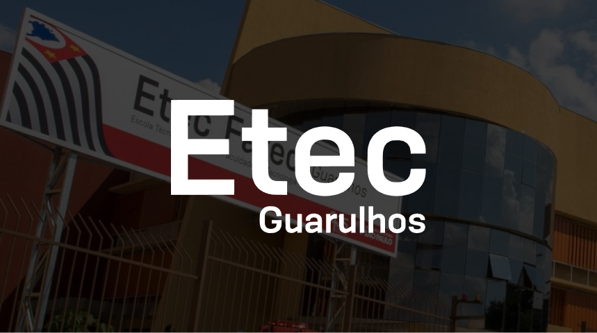
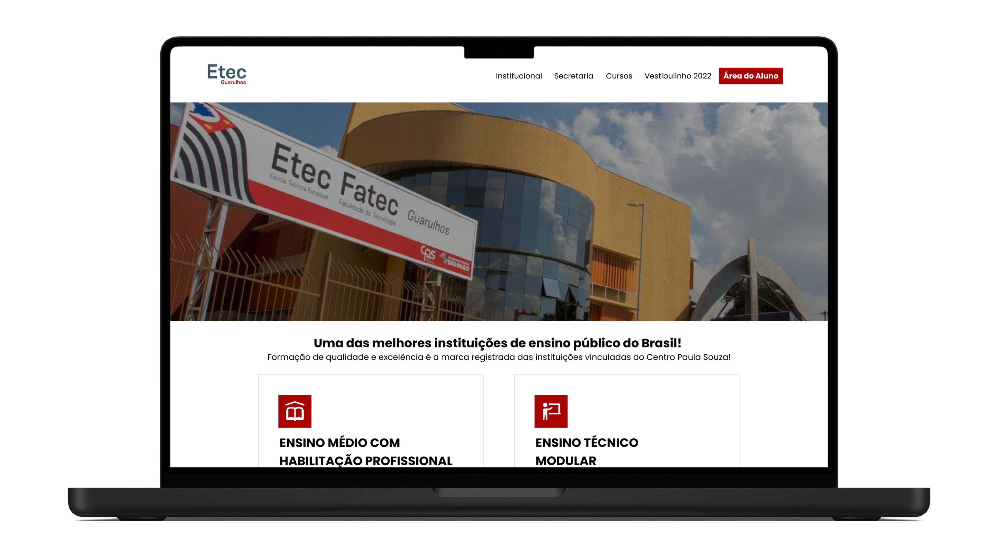

# 🏫 Projeto - Etec de Guarulhos

Bem-vindo ao repositório da Etec Guarulhos! Este é um projeto de redesign do site da Etec de Guarulhos, com o objetivo de atualizar e modernizar seu design. Tendo em vista que, o site da Etec de Guarulhos precisa de uma renovação de design para atender às expectativas modernas de usabilidade e aparência. Este projeto se concentra em melhorar a estética e a experiência do usuário.

  

## ✏️ Protótipo

O objetivo da BeKind é promover a solidariedade, a empatia e a compaixão em relação às pessoas em situação de vulnerabilidade. A plataforma visa conectar voluntários, vulneráveis e organizações que desejam fazer a diferença na vida dessas pessoas, fornecendo uma maneira fácil e eficiente de contribuir para a causa social.

  

            